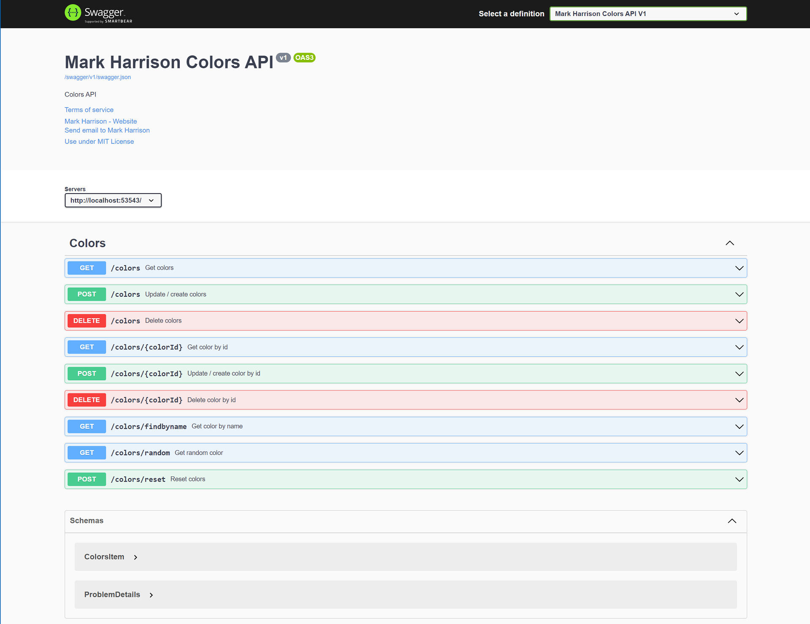

# ColorsAPI

https://markharrison.io/

19 April 2022 : Updated to .NET 6.0

14 May 2024 : Updated to .NET 8.0

Demo: https://colors-api.azurewebsites.net

Also see: <https://github.com/markharrison/ColorsWeb>

Images: <https://github.com/markharrison/ColorsAPI/pkgs/container/colorsapi>

- docker pull ghcr.io/markharrison/colorsapi:latest
- docker pull ghcr.io/markharrison/colorsapi:blue
- docker pull ghcr.io/markharrison/colorsapi:green

## Configuration

Environment variables / configuration 

| Key          | Value     |  
|--------------|-----------| 
| ASPNETCORE_HTTP_PORTS | 8080  |  

## Package 

<https://github.com/markharrison/ColorsAPI/pkgs/container/colorsapi>
